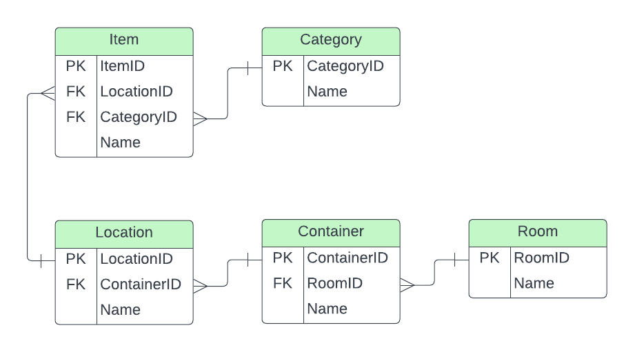

# Database Localizer Project

This project aims to compare two different approaches for building a database localizer system: relational and recursive. The database localizer system serves as a tool to manage and keep track of various items, their locations, and other relevant information within a home.

1. **Relational Approach**: This approach involves structuring the localizer database using traditional relational database principles, where data is organized into tables with predefined relationships between them.



2. **Recursive Approach**: The recursive approach utilizes hierarchical or recursive data structures to model the localizer system, allowing for a more flexible and dynamic organization of locations of items and their relationships.


## All Location Paths
1.  **Relational Approach**: This query retrieves the names of items and their complete location paths within the premises. It constructs the location path by concatenating the names of the room, container, and location of each item. If the container or location name has a NULL value, it is omitted from the path.
```sql
SELECT i.Name,
    CONCAT( r.Name, '/',
    COALESCE(c.Name + '/',''),
    COALESCE(l.Name + '/',''),
    i.Name) AS LocationPath
FROM Item i
    JOIN Location l ON i.LocationID = l.LocationID
    JOIN Container c ON l.ContainerID = c.ContainerID
    JOIN Room r ON c.RoomID = r.RoomID
```
**Query results:**

|   |Name                   |LocationPath                                       |
|---|-----------------------|---------------------------------------------------|
|1  |Car                    |Garage/Car                                         |
|2  |Bicycle                |Garage/Bicycle                                     |
|3  |Hammer drill           |Garage/Tool Cabinet/Top Shelf/Hammer drill         |
|4  |Electric Screwdriver   |Garage/Tool Cabinet/Top Shelf/Electric Screwdriver |
|5  |Sprayer                |Garage/Tool Cabinet/Bottom Shelf/Sprayer           |
|6  |Paper Towels           |Pantry/Cabinet/Right Top Shelf/Paper Towels        |
|7  |Gloves                 |Pantry/Cabinet/Right Middle Shelf/Gloves           |
|8  |Headache Pill          |Bedroom/Wardrobe/Right Top Shelf/Headache Pill     |
|9  |Books                  |Bedroom/Wardrobe/Right Top Shelf/Books             |
|10 |Bedding                |Bedroom/Wardrobe/Left Top Shelf/Bedding            |
|11 |Towels                 |Bedroom/Wardrobe/Left Top Shelf/Towels             |
|12 |Bed                    |Bedroom/Bed                                        |


2. **Recursive Approach**: This query also retrieves the names of items and their location paths but employs a recursive common table expression (CTE) to traverse the hierarchical structure of the items' locations. It starts with items with no containers (i.e., located directly in a room). Then, it recursively traverses through containers to build the complete location path for each item. The results include the location paths of the items and each container.
```sql
WITH ContainItem(Name, ItemID, ContainerID, LocationPath) AS
(
    SELECT Name, ItemID, ContainerID, CAST(Name AS NVARCHAR(MAX)) AS LocationPath
    FROM Item 
    WHERE ContainerID IS NULL
    UNION ALL
    SELECT i.Name, i.ItemID, i.ContainerID, c.LocationPath + '/' + CAST(i.Name AS NVARCHAR(MAX))
    FROM Item i
        INNER JOIN ContainItem AS c
        ON i.ContainerID = c.ItemID
)
SELECT Name, LocationPath
FROM ContainItem
```
**Query results:**

|   |Name                   |LocationPath                                       |
|---|-----------------------|---------------------------------------------------|
|1  |Garage                 |Garage                                             |
|2  |Pantry                 |Pantry                                             |
|3  |Bedroom                |Bedroom                                            |
|4  |Bed                    |Bedroom/Bed                                        |
|5  |Wardrobe               |Bedroom/Wardrobe                                   |
|6  |Right Top Shelf        |Bedroom/Wardrobe/Right Top Shelf                   |
|7  |Right Bottom Shelf     |Bedroom/Wardrobe/Right Bottom Shelf                |
|8  |Left Top Shelf         |Bedroom/Wardrobe/Left Top Shelf                    |
|9  |Bedding                |Bedroom/Wardrobe/Left Top Shelf/Bedding            |
|10 |Towels                 |Bedroom/Wardrobe/Left Top Shelf/Towels             |
|11 |Book                   |Bedroom/Wardrobe/Right Bottom Shelf/Book           |
|12 |Headache Pill          |Bedroom/Wardrobe/Right Top Shelf/Headache Pill     |
|13 |Cabinet                |Pantry/Cabinet                                     |
|14 |Right Top Shelf        |Pantry/Cabinet/Right Top Shelf                     |
|...|                       |                                                   |


Adding a WHERE clause to filter out items that are not containers effectively limits the results to only the items themselves, excluding any containers from the output. This ensures that the query returns only the items stored at the lowest level of the hierarchy, rather than including intermediate containers.

```sql
WITH ContainItem(Name, ItemID, ContainerID, LocationPath) AS
(
    SELECT Name, ItemID, ContainerID, CAST(Name AS NVARCHAR(MAX)) AS LocationPath
    FROM Item 
    WHERE ContainerID IS NULL
    UNION ALL
    SELECT i.Name, i.ItemID, i.ContainerID, c.LocationPath + '/' + CAST(i.Name AS NVARCHAR(MAX))
    FROM Item i
        INNER JOIN ContainItem AS c
        ON i.ContainerID = c.ItemID
)
SELECT Name, LocationPath
FROM ContainItem ci
WHERE NOT EXISTS (
    SELECT 1
    FROM Item i
    WHERE i.ContainerID = ci.ItemID
);
```
**Query results:**

|   |Name                   |LocationPath                                       |
|---|-----------------------|---------------------------------------------------|
|1  |Bed                    |Bedroom/Bed                                        |
|2  |Bedding                |Bedroom/Wardrobe/Left Top Shelf/Bedding            |
|3  |Towels                 |Bedroom/Wardrobe/Left Top Shelf/Towels             |
|4  |Book                   |Bedroom/Wardrobe/Right Bottom Shelf/Book           |
|5  |Headache Pill          |Bedroom/Wardrobe/Right Top Shelf/Headache Pill     |
|6  |Gloves                 |Pantry/Cabinet/Right Middle Shelf/Gloves           |
|7  |Paper Towels           |Pantry/Cabinet/Right Top Shelf/Paper Towels        |
|8  |Car                    |Garage/Car                                         |
|9  |Bicycle                |Garage/Bicycle                                     |
|10 |Sprayer                |Garage/Tool Cabinet/Bottom Shelf/Sprayer           |
|11 |Hammer Drill           |Garage/Tool Cabinet/Top Shelf/Hammer Drill         |
|12 |Electric Screwdriver   |Garage/Tool Cabinet/Top Shelf/Electric Screwdriver |


## Item location

1.  **Relational Approach**: In this query, we only add a condition ```WHERE i.Name = 'Towels';``` to the query from All Location Paths. This restriction ensures that only information about the "Towels" item is retrieved from the database. 

```sql
SELECT i.Name, 
    CONCAT( r.Name, '/',
    COALESCE(c.Name + '/',''),
    COALESCE(l.Name + '/',''),
    i.Name) AS LocationPath
FROM Item i
    JOIN Location l ON i.LocationID = l.LocationID
    JOIN Container c ON l.ContainerID = c.ContainerID
    JOIN Room r ON c.RoomID = r.RoomID
WHERE i.Name = 'Towels';
```
**Query result:**

|   |Name                   |LocationPath                                       |
|---|-----------------------|---------------------------------------------------|
|1  |Towels                 |Bedroom/Wardrobe/Left Top Shelf/Towels             |

2. **Recursive Approach**: A similar approach is used here, which only adds a condition WHERE Name = 'Towels' to the query for All Location Paths. Although it gives us a correct location, this approach could be more optimal because it requires generating all possible paths and than selecting only one. 

```sql
WITH ContainItem(Name, ItemID, ContainerID, LocationPath) AS
(
    SELECT Name, ItemID, ContainerID, CAST(Name AS NVARCHAR(MAX)) AS LocationPath
    FROM Item 
    WHERE ContainerID IS NULL
    UNION ALL
    SELECT i.Name, i.ItemID, i.ContainerID, c.LocationPath + '/' + CAST(i.Name AS NVARCHAR(MAX))
    FROM Item i
        INNER JOIN ContainItem AS c
        ON i.ContainerID = c.ItemID
)
SELECT Name, LocationPath
FROM ContainItem
WHERE Name='Towels'
```
**Query result:**

|   |Name                   |LocationPath                                       |
|---|-----------------------|---------------------------------------------------|
|1  |Towels                 |Bedroom/Wardrobe/Left Top Shelf/Towels             |

A better approach is when we initiate the search for the location path from the item itself, traversing backward through its containers in the hierarchy until reaching the top-level container. Here, we avoid generating all possible paths; instead, we only retrieve paths relevant to the item being searched for. At the end, we need to add the condition 'WHERE ContainerID IS NULL' to receive only the full path.

```sql
WITH ItemContainer(Name, ItemID, ContainerID, LocationPath) AS
(
    SELECT Name, ItemID, ContainerID, CAST(Name AS NVARCHAR(MAX)) AS LocationPath
    FROM Item 
    WHERE Name = 'Towels'
    UNION ALL
    SELECT i.Name, i.ItemID, i.ContainerID, CAST(i.Name AS NVARCHAR(MAX)) + '/' + c.LocationPath
    FROM Item i
        INNER JOIN ItemContainer AS c
        ON i.ItemID = c.ContainerID
)
SELECT Name, LocationPath
FROM ItemContainer
WHERE ContainerID IS NULL
```
**Query result:**
|   |Name                   |LocationPath                                       |
|---|-----------------------|---------------------------------------------------|
|1  |Towels                 |Bedroom/Wardrobe/Left Top Shelf/Towels             |
