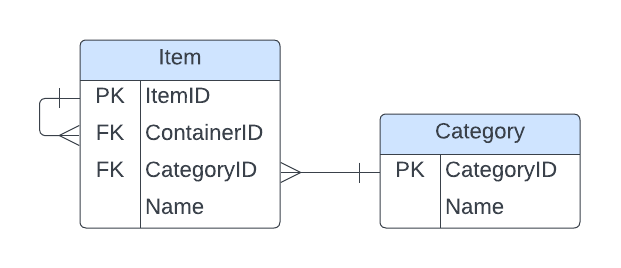

# Database Localizer Project

This project aims to compare two different approaches for building a database localizer system: relational and recursive. The database localizer system serves as a tool to manage and keep track of various items, their locations, and other relevant information within a home.

1. **Relational Approach**: This approach involves structuring the localizer database using traditional relational database principles, where data is organized into tables with predefined relationships between them.

2. **Recursive Approach**: The recursive approach utilizes hierarchical or recursive data structures to model the localizer system, allowing for a more flexible and dynamic organization of locations of items and their relationships.

## All Location Paths
1.  **Relational Approach**:

2. **Recursive Approach**:
