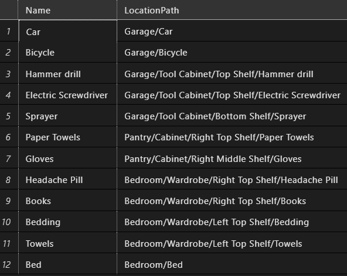

# Database Localizer Project

This project aims to compare two different approaches for building a database localizer system: relational and recursive. The database localizer system serves as a tool to manage and keep track of various items, their locations, and other relevant information within a home.

1. **Relational Approach**: This approach involves structuring the localizer database using traditional relational database principles, where data is organized into tables with predefined relationships between them.


2. **Recursive Approach**: The recursive approach utilizes hierarchical or recursive data structures to model the localizer system, allowing for a more flexible and dynamic organization of locations of items and their relationships.


## All Location Paths
1.  **Relational Approach**:
```sql
SELECT 
	CONCAT( r.Name, '/',
	COALESCE(c.Name + '/',''),
	COALESCE(l.Name + '/',''),
	i.Name) AS LocationPath
FROM Item i
	JOIN Location l ON i.LocationID = l.LocationID
	JOIN Container c ON l.ContainerID = c.ContainerID
	JOIN Room r ON c.RoomID = r.RoomID
```


2. **Recursive Approach**:
```sql
WITH ContainItem(Name, ItemID, ContainerID, LocationPath) AS
(
    SELECT Name, ItemID, ContainerID, CAST(Name AS NVARCHAR(MAX)) AS LocationPath
    FROM Item 
    WHERE ContainerID IS NULL
    UNION ALL
    SELECT i.Name, i.ItemID, i.ContainerID, c.LocationPath + '/' + CAST(i.Name AS NVARCHAR(MAX))
    FROM Item i
        INNER JOIN ContainItem AS c
        ON i.ContainerID = c.ItemID
)
SELECT Name, LocationPath
FROM ContainItem
```
```sql
WITH ContainItem(Name, ItemID, ContainerID, LocationPath) AS
(
    SELECT Name, ItemID, ContainerID, CAST(Name AS NVARCHAR(MAX)) AS LocationPath
    FROM Item 
    WHERE ContainerID IS NULL
    UNION ALL
    SELECT i.Name, i.ItemID, i.ContainerID, c.LocationPath + '/' + CAST(i.Name AS NVARCHAR(MAX))
    FROM Item i
        INNER JOIN ContainItem AS c
        ON i.ContainerID = c.ItemID
)
SELECT Name, LocationPath
FROM ContainItem ci
WHERE NOT EXISTS (
    SELECT 1
    FROM Item i
    WHERE i.ContainerID = ci.ItemID
);
```
